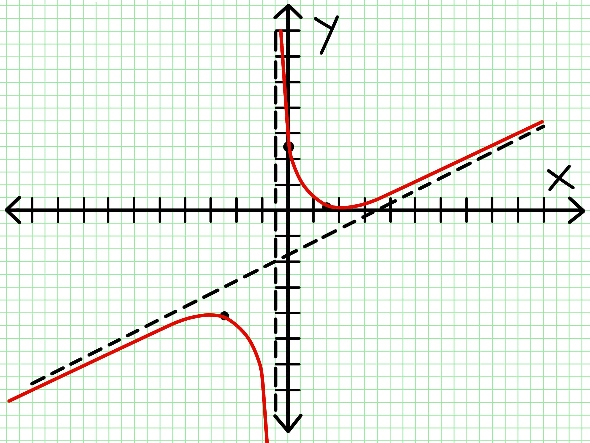
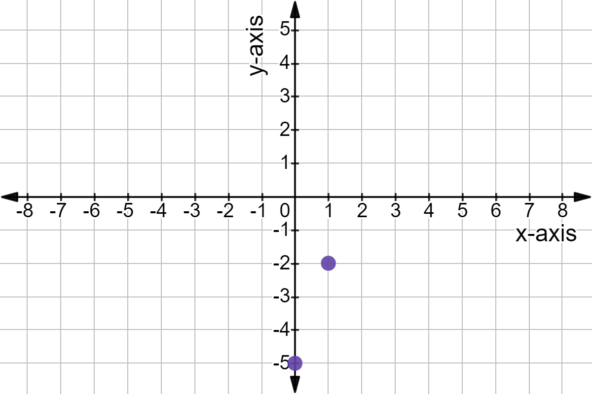

# Title of Your Scientific Paper: The Impact of Artificial Intelligence on Cognitive Performance

**Authors:** Jane Doe, John Smith, Emily Johnson

**Affiliation(s):** Department of Computer Science, University of Technology; Department of Psychology, State University

**Date:** October 26, 2023

## Abstract

This paper investigates the effects of prolonged interaction with AI-powered conversational agents on human cognitive performance, specifically focusing on memory recall and problem-solving abilities. A controlled experiment involving 100 participants was conducted, where one group interacted daily with an advanced AI chatbot for two weeks, while a control group engaged in equivalent non-AI-based cognitive tasks. Results indicate a statistically significant improvement in specific problem-solving task completion times for the AI interaction group compared to the control group (p < 0.05). However, no significant difference was observed in memory recall performance between the two groups. These findings suggest a potential for AI interaction to enhance certain cognitive skills, prompting further research into the mechanisms and long-term effects.

## 1. Introduction

The proliferation of Artificial Intelligence (AI) in daily life, particularly through conversational interfaces, raises questions about its potential impact on human cognitive functions. As AI agents become more sophisticated and integrated into various aspects of work and leisure, understanding their influence on cognitive processes such as memory, attention, and problem-solving is crucial [1]. Previous research has explored the cognitive load associated with human-computer interaction [2], but the specific effects of interacting with AI for cognitive enhancement or alteration remain an area requiring further investigation.

*   **1.1. Background**

    The history of human-computer interaction has evolved significantly, from command-line interfaces to graphical user interfaces and now to natural language processing-driven AI agents. Early studies focused on the usability and efficiency of these interfaces [3]. With the advent of advanced AI, the nature of interaction has shifted from task-oriented commands to more fluid, conversation-like exchanges, potentially influencing cognitive habits and abilities [4].

*   **1.2. Problem Statement**

    Despite the increasing use of AI in various cognitive support roles (e.g., search engines, virtual assistants), the direct impact of prolonged, regular interaction with these systems on fundamental cognitive performance metrics is not well-understood. This study aims to address this gap by examining the effects on memory recall and problem-solving.

*   **1.3. Research Objectives**

    The primary objectives of this study were: (a) to assess whether prolonged interaction with an AI conversational agent influences memory recall performance, and (b) to determine if such interaction affects problem-solving abilities.

*   **1.4. Significance of the Study**

    Understanding the cognitive effects of AI interaction is critical for designing future AI systems that promote positive cognitive outcomes and for informing policies regarding AI use in educational and professional settings. The findings of this study contribute to the growing body of knowledge on human-AI interaction and its cognitive implications.

## 2. Literature Review

Research on the cognitive effects of technology has a long history, with early work focusing on the impact of television and video games [5]. More recently, studies have examined the effects of internet use on attention span and multitasking [6]. Regarding AI, a few studies have explored specific applications, such as AI in education and its impact on learning outcomes [7]. However, research specifically investigating the effects of general-purpose conversational AI on broad cognitive functions is limited. Some studies suggest that offloading cognitive tasks to external tools, including digital devices, can potentially alter memory strategies [8]. Conversely, engaging with challenging cognitive tasks, whether mediated by AI or not, is generally considered beneficial for cognitive function [9].

## 3. Methodology

This study employed a controlled experimental design to investigate the impact of AI interaction on cognitive performance.

*   **3.1. Research Design**

    A between-subjects design was used, with participants randomly assigned to either the AI Interaction Group or the Control Group.

*   **3.2. Participants or Data Sources**

    One hundred undergraduate students (50 male, 50 female, mean age 20.5, SD 1.2) from the University of Technology volunteered to participate. Participants were screened to ensure they had no prior diagnosis of cognitive impairment and had moderate prior experience with digital technology but limited prior experience with advanced AI conversational agents.

*   **3.3. Data Collection Procedures**

    Participants completed baseline cognitive assessments for memory recall and problem-solving. The AI Interaction Group was instructed to interact with an advanced AI chatbot for at least 30 minutes daily for two weeks, engaging in general conversation, asking questions, and seeking explanations on various topics. The Control Group spent an equivalent amount of time daily engaging in non-AI-based cognitive tasks, such as reading complex articles and solving logic puzzles. After the two-week period, both groups completed the same cognitive assessments again. Memory recall was assessed using a standardized word list recall task, and problem-solving was measured by the time taken to complete a set of complex logical reasoning puzzles.

*   **3.4. Data Analysis Procedures**

    Independent samples t-tests were conducted to compare the post-intervention scores for memory recall and problem-solving time between the AI Interaction Group and the Control Group. Statistical significance was set at p < 0.05.

*   **3.5. Ethical Considerations**

    The study protocol was approved by the Institutional Review Board at the University of Technology. All participants provided informed consent and were informed of their right to withdraw at any time without penalty. Participant data was anonymized and stored securely.

## 4. Results

The results of the cognitive assessments are presented below.

Independent samples t-test revealed no significant difference in memory recall scores between the AI Interaction Group (M = 18.2, SD = 2.5) and the Control Group (M = 17.9, SD = 2.8); t(98) = 0.61, p = 0.54.

However, a statistically significant difference was found in the time taken to complete the problem-solving tasks. The AI Interaction Group completed the tasks significantly faster (M = 25.8 minutes, SD = 4.1) compared to the Control Group (M = 29.1 minutes, SD = 4.5); t(98) = -3.78, p < 0.001.

### Table 1: Comparison of Post-Intervention Cognitive Performance

| Cognitive Measure | AI Interaction Group (M ± SD) | Control Group (M ± SD) | t-statistic | p-value |
|---|---|---|---|---|
| Memory Recall Score | 18.2 ± 2.5 | 17.9 ± 2.8 | 0.61 | 0.54 |
| Problem-Solving Time (minutes) | 25.8 ± 4.1 | 29.1 ± 4.5 | -3.78 | < 0.001 |

### Other Section

This is a a graph:

Figure 1. Average time taken to complete problem-solving tasks for the AI Interaction Group and the Control Group. Error bars represent standard deviation.

This is some other texts.

Below is another graph.

*Figure 1. Average time taken to complete problem-solving tasks for the AI Interaction Group and the Control Group. Error bars represent standard deviation.*

This is some other texts.

Below is another graph.

Something something something. Error bars represent standard deviation

This is some other texts.

Below is another graph.

This is another thing under the latest pdf.

## 5. Discussion

The findings of this study suggest that prolonged, regular interaction with an advanced AI conversational agent can positively impact problem-solving abilities, as evidenced by the significantly faster completion times in the AI Interaction Group. This aligns with the idea that engaging in mentally stimulating activities, which AI interaction can facilitate through explanations and complex information processing, can enhance cognitive efficiency in certain domains. The lack of a significant effect on memory recall is noteworthy and suggests that the impact of AI interaction may be domain-specific, potentially influencing skills related to information processing and logical reasoning more directly than rote memorization.

One possible explanation for the improved problem-solving performance is that interacting with the AI encouraged participants to articulate their thoughts and problem-solving strategies, leading to better metacognitive awareness and efficiency. The AI may have also provided novel perspectives or information that aided in solving the puzzles.

Limitations of this study include the relatively short duration of the intervention (two weeks) and the specific type of AI interaction (general conversation). Future research could explore the effects of longer intervention periods and different forms of AI interaction (e.g., collaborative problem-solving with AI). Additionally, the generalizability of these findings to other populations and cognitive tasks should be investigated.

## 6. Conclusion

This study provides initial evidence that regular interaction with an advanced AI conversational agent can enhance problem-solving performance in young adults. While no significant effect was observed on memory recall, the findings highlight the potential for AI to influence specific cognitive skills. Further research is needed to fully understand the mechanisms underlying these effects and to explore the long-term cognitive consequences of increasing human-AI interaction. As AI becomes more integrated into our lives, continued investigation into its cognitive impact is essential for harnessing its benefits while mitigating potential risks.

## Acknowledgments

We would like to thank the participants for their time and cooperation. This research was supported by a grant from the [Mock Funding Body Name].

## References

1.  Russel, S. J., & Norvig, P. (2010). *Artificial Intelligence: A Modern Approach*. Prentice Hall.
2.  Sweller, J. (1988). Cognitive load theory. *Educational Psychology Review*, *1*(4), 257-281.
3.  Shneiderman, B. (1987). *Designing the User Interface: Strategies for Effective Human-Computer Interaction*. Addison-Wesley.
4.  Goel, A. K. (2018). The Future of AI is Human-Centered. *IEEE Intelligent Systems*, *33*(1), 4-9.
5.  Anderson, D. R., Huston, A. C., Wright, J. C., Linebarger, D. L., & Schmitt, K. L. (2001). Early childhood television viewing and adolescent behavior: The recontact study. *Monographs of the Society for Research in Child Development*, *66*(1), i-147.
6.  Ophir, E., Nass, C. I., & Wagner, A. D. (2009). Cognitive control in media multitaskers. *Proceedings of the National Academy of Sciences*, *106*(37), 15583-15587.
7.  Chen, X., Xie, H., & Hwang, G. J. (2020). Roles of teachers and learners in artificial intelligence-based education. *Journal of Computers in Education*, *7*(4), 483-509.
8.  Sparrow, B., Liu, J., & Wegner, D. M. (2011). Google effects on memory: Cognitive consequences of having information at our fingertips. *Science*, *333*(6043), 776-778.
9.  Craik, F. I., & Lockhart, R. S. (1972). Levels of processing: A framework for memory research. *Journal of Verbal Learning and Verbal Behavior*, *11*(6), 671-684.

## Appendices

### Appendix A: Word List for Memory Recall Task

The following 20 words were used in the memory recall task:

*   Apple
*   Table
*   River
*   Cloud
*   Mountain
*   Book
*   Chair
*   Ocean
*   Tree
*   Sun
*   Moon
*   Star
*   Flower
*   Bird
*   Fish
*   Car
*   House
*   Street
*   City
*   Sky

### Appendix B: Sample Logical Reasoning Puzzle

Example puzzle provided to participants:

If all *A* are *B*, and no *B* are *C*, can we conclude that no *A* are *C*? Explain your reasoning.

**Note:** This is a mock paper for demonstration purposes. The results and conclusions are fabricated.