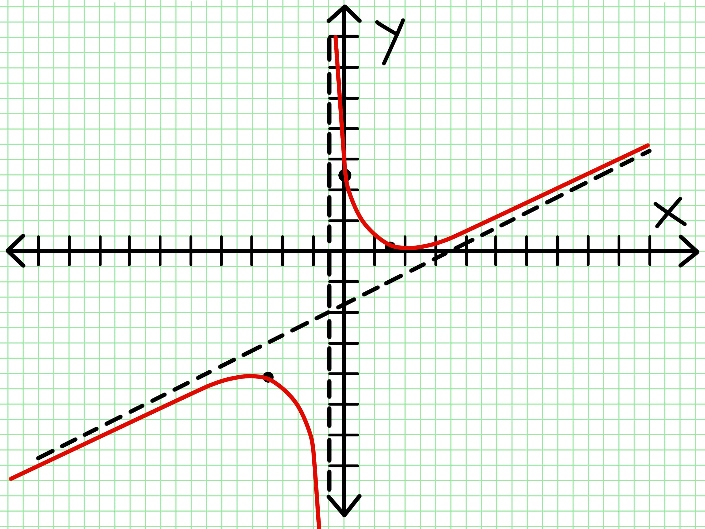

# Main Heading

This is a test document to verify the new features in mdtexpdf.

## Image Sizing Feature

The image below should be automatically sized to fit the page width:

## TOC Depth Feature

This document has headings up to level 4 to test the TOC depth feature.

### Level 3 Heading

This heading should appear in the TOC when the TOC depth is set to 3 or higher.

#### Level 4 Heading

This heading should appear in the TOC when the TOC depth is set to 4 or higher.

##### Level 5 Heading

This heading should appear in the TOC when the TOC depth is set to 5.

## Another Section

This is another section to test the TOC.

### Another Level 3 Heading

This is another level 3 heading.

#### Another Level 4 Heading

This is another level 4 heading.